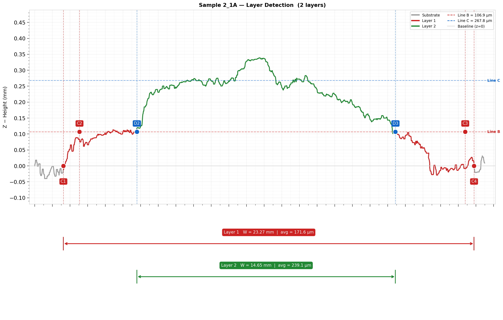
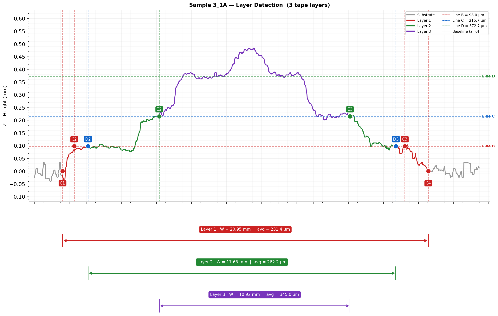

# AFP Layer Detection from LLS Cross-Section Profiles

**Author:** Gamar Ismayilova
**Affiliation:** TU Delft, Department of Aerospace Structures and Materials
**Contact:** gamar.ismayilova@gmail.com

## 1. Overview

Automated detection of tape layer count, reference height levels, and geometric vertices (feet and shoulders) from Laser Line Scanner (LLS) cross-section profiles of AFP stacked-tow specimens. The algorithm handles 2-layer, 2-layer with repass, and 3-layer configurations without manual parameter tuning.

### Example Output

| Type 1 (2-layer) | Type 2 (2-layer + repass) | Type 3 (3-layer) |
|:-:|:-:|:-:|
|  |  |  |

## 2. Mathematical Foundations

### 2.1 Signal Conditioning

#### Spike Removal

A large-kernel median filter (K = 51 samples) extracts the low-frequency trend. The residual is computed:

```
r(i) = z_raw(i) − median_K(z_raw)(i)
σ = std(r)
```

Points where |r(i)| > 5σ are replaced by the local median trend value. This removes single-point artefacts from specular reflections.

#### Noise Suppression

A second median filter (K = 11 samples) suppresses broadband measurement noise while preserving sharp layer transitions.

#### Linear Detrend

The outer 8% of data points on each side (flat regions outside the tape) are used to fit a linear trend. This trend is subtracted to remove scanner tilt:

```
z_detrended = z_filtered − (slope · x + intercept)
```

After detrending, the substrate baseline sits at z ≈ 0.

### 2.2 Layer Level Detection (Histogram-Based)

The height histogram of the detrended profile is computed with 40 bins. Layer plateau heights appear as peaks in this histogram.

#### Stage 1 — Standard Peak Detection

Histogram peaks are found with `scipy.signal.find_peaks` requiring prominence ≥ 6% of the maximum bin count. Peaks below 12% of the Z range are rejected (substrate/noise region). Consecutive levels must satisfy a minimum step-size criterion:

```
step_i ≥ 0.50 × max(L1, step_{i-1})
```

where L1 is the first detected level height. Using `max(L1, previous_step)` guards against both small-L1 and large-step-drop failure modes.

#### Stage 2 — Supplemental Upper-Layer Detection

For dome-shaped inner layers that produce weak histogram peaks, a second pass scans for peaks above the highest detected level. A supplemental peak is accepted only when both conditions hold:

```
prominence ≥ 0.20 × max(histogram counts)
step ≥ 0.45 × previous inter-level step
```

This dual-gate prevents false detections from histogram noise while catching genuine upper layers.

### 2.3 Band-to-Tape-Layer Mapping

When intermediate histogram levels do not correspond to distinct physical tape layers (e.g. a repass creating a sub-level), the algorithm groups bands into tape layers. A band increments the tape-layer counter only if the previous band's height exceeds:

```
threshold = 0.70 × L1
```

Bands below this threshold are merged with the previous tape layer for colouring and width reporting.

### 2.4 Vertex Detection (Foot and Shoulder)

For each band between reference levels z_lo and z_hi, the algorithm finds four vertices: left foot, left shoulder, right shoulder, right foot.

#### Gradient Computation

The derivative dZ/dX is computed via a Savitzky-Golay filter (window = 81, polynomial order = 3, first derivative). This provides smooth gradient estimates robust to noise.

#### Gradient Peak Selection

Within the search window, gradient peaks are detected and ranked by |dZ/dX| magnitude (not prominence). Magnitude ranking is more robust because search-window boundaries artificially inflate prominence.

For Band 0 (outermost tape edge), the search is restricted to the outer zone (30% of tape half-width, maximum 5 mm).

For Band 1+ (inner layers), the right-side search window is centred on the mirror position of the left foot:

```
x_center = 2 × x_mid − x_left_foot
search window = [x_center − 2 mm, x_center + 2 mm]
```

This symmetric constraint prevents inner bump-slopes from being selected as layer edges.

#### Slope Line Fitting

For the strongest gradient peak, the slope window is expanded where |dZ/dX| > 12% of the peak gradient. A linear regression is fitted through this window:

```
z = slope · x + intercept
```

#### Foot and Shoulder Intersection

The foot and shoulder are the intersections of the slope line with the reference levels:

```
x_foot = (z_lo − intercept) / slope
x_shoulder = (z_hi − intercept) / slope
```

Both intersections are validated to lie within a margin of the slope window. If validation fails, the next-strongest gradient peak is tried (up to 10 candidates).

### 2.5 Width and Height Computation

```
Layer width = x_right_foot − x_left_foot
Average height = mean(z) for x ∈ [x_left_foot, x_right_foot]
```

## 3. Usage

### Single specimen

```python
from layer_detection import run

# Auto-derives sample name from filename
result = run("path/to/Sample_3_1A_00010.slk", output_dir="results")
```

### Batch processing

```python
import glob
from layer_detection import run

for f in sorted(glob.glob("data/*.slk")):
    run(f, output_dir="results")
```

### Command line

```bash
python layer_detection.py data/Sample_3_1A_00010.slk -o results
python layer_detection.py data/*.slk -o results
```

## 4. Parameters

| Parameter | Value | Description |
|-----------|-------|-------------|
| `SPIKE_KERNEL` | 51 | Spike removal median filter width (samples) |
| `MEDIAN_KERNEL` | 11 | Noise suppression median filter width (samples) |
| `DETREND_FRAC` | 0.08 | Fraction of outer data used for linear detrend |
| `HIST_BINS` | 40 | Number of histogram bins for level detection |
| `LINE_B_FLOOR` | 0.12 | Minimum level height as fraction of Z range |
| `MIN_STEP_RATIO` | 0.50 | Minimum step height relative to max(L1, previous step) |
| `SG_WIN` | 81 | Savitzky-Golay window for gradient computation |
| `SG_POLY` | 3 | Savitzky-Golay polynomial order |
| `MERGE_RATIO` | 0.70 | Minimum band height fraction to count as new tape layer |
| `OUTER_ZONE_FRAC` | 0.30 | Band 0 search zone as fraction of tape half-width |
| `SYM_MARGIN` | 2.0 mm | Band 1+ right search window half-width |

## 5. Output

For each specimen:
- **PNG figure** — two-panel plot: colour-coded profile with reference lines, vertex labels (C1–C4, D2–D3, E2–E3), and width brackets with measurements.
- **Console report** — vertex coordinates, layer widths, and average heights.

## 6. Dependencies

numpy, scipy, matplotlib (same as root `requirements.txt`).
